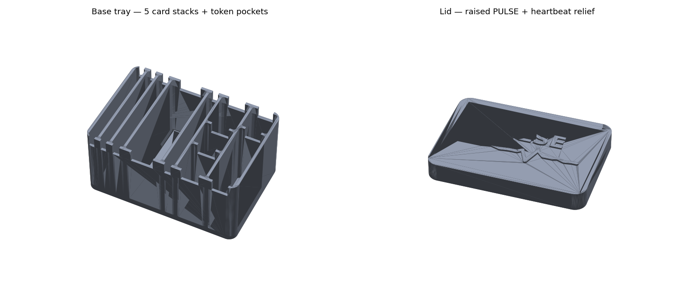

# Pulse — organizer box & lid (3D print)

A single-color, rounded-corner tray that holds a full **Pulse** set: the five
card types each stand up in their own little stack, and every token has a
pocket. A telescoping lid drops over the top and carries the game's identity in
**raised relief** — the word `PULSE` over a heartbeat waveform (the same motif
engraved on the Pulse token).



Generated by [`make_box.py`](make_box.py). Prefer the **`.3mf`**.

| File | What |
|---|---|
| [`pulse-box.3mf`](pulse-box.3mf) | **Base + lid in one file** (preferred) |
| [`pulse-box-base.stl`](pulse-box-base.stl) | tray only |
| [`pulse-box-lid.stl`](pulse-box-lid.stl) | lid only |
| [`box-layout.png`](box-layout.png) | top-view of the compartments |

## Dimensions

- **Base outer:** 143.6 × 97.2 × 68.4 mm — **interior 138 × 92 × 66 mm**.
- **Lid outer:** ~150 × 103 × 20 mm (skirt slides ~16 mm over the base).
- Fits any 180 mm+ print bed. Prints in **one color**, no painting required.

## Layout

Cards stand on their **long (88 mm) edge**, 63 mm tall, so five stacks sit
side-by-side and stay sorted. See [`box-layout.png`](box-layout.png).

| Compartment | Holds | Compartment | Holds |
|---|---|---|---|
| Story | 6 cards | Pulse | 7 discs (20 ø) |
| Character | 5 cards | Drift | 12 cubes (12 mm) |
| Part | 8 cards | Swing | 3 stars (21 mm) |
| Feeling | 32 cards | Baton | 1 (long channel, 64 mm) |
| Reference | 6 cards | Story Marker | 1 pawn (22 ø) |

Card wells are sized for a comfortable un-sleeved to lightly-sleeved fit. Every
well has **finger-scoops** notched into the wall tops so you can pinch a stack
or scoop tokens out of the deep box.

## Printing

- **FDM:** 0.2 mm layers, 3 perimeters, 10–15 % infill. Walls are 2.6 mm and
  dividers 2.4 mm — sturdy, no supports needed.
- **Base:** print as-is (open side up).
- **Lid:** print top-plate-down (relief on the bed) *or* right-side-up — the
  raised lettering/waveform is a shallow 1.6 mm relief and needs no supports
  either way. Big, bold shapes only; nothing small enough to fail.
- **Fit:** the lid telescopes with 0.5 mm clearance per side. If your printer
  runs large and it's too tight, scale the lid up ~0.5 %, or bump `CLEAR` in
  [`make_box.py`](make_box.py) and regenerate.

## Regenerate

```bash
cd games/pulse/box
python make_box.py    # needs: numpy trimesh shapely manifold3d matplotlib lxml
```

Both bodies export watertight (manifold), in millimetres — load the `.3mf`
straight into your slicer.

*Tokens themselves live in [`../tokens/`](../tokens/); cards & rules are the
PDFs one level up. See [../Pulse-Print-and-Play.md](../Pulse-Print-and-Play.md).*
</content>
</invoke>
