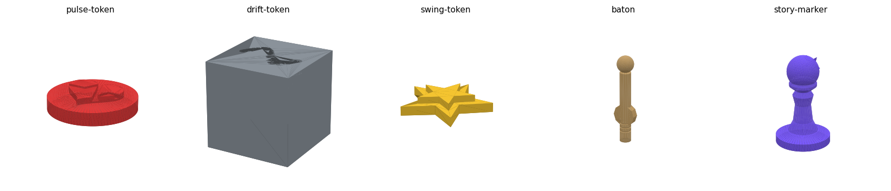

# Pulse — tokens & accessories (2D prototypes → 3D STL)

Print-and-play upgrade: physical tokens for **Pulse**. The *metronome is excluded*
(use a phone app). Each piece exists as a 2D SVG prototype and a 3D-printable STL,
generated by [`make_stl.py`](make_stl.py).



| Piece | Qty | SVG | STL | Size (mm) | Notes |
|---|---|---|---|---|---|
| **Pulse** | 7 | [svg](pulse-token.svg) | [stl](pulse-token.stl) | 20 ø × 4.4 | disc + raised heart, recessed pulse-line |
| **Drift** | 12 | [svg](drift-token.svg) | [stl](drift-token.stl) | 12 cube | engraved drift tilde on top |
| **Swing** | 3 | [svg](swing-token.svg) | [stl](swing-token.stl) | 21 × 4 | faceted 5-point star on a sturdy base |
| **Baton** | 1 | [svg](baton.svg) | [stl](baton.stl) | 16 × 64 | shaft + knob + 10-facet era dial + grip rings |
| **Baton (bare)** | 1 | [svg](baton.svg) | [stl](baton-bare.stl) | 14 × 64 | no dial — flat seat to glue on a real d10 |
| **Story Marker** | 1 | [svg](story-marker.svg) | [stl](story-marker.stl) | 22 ø × 36.5 | pawn with raised star "you-are-here" |

`_contact-sheet.svg` shows the 2D prototypes together; `all-tokens.stl` is a combined
preview plate.

## Regenerate

```bash
cd games/pulse/tokens
python make_stl.py        # needs: numpy trimesh shapely manifold3d mapbox_earcut
```

All meshes are watertight (manifold) and in millimetres — load straight into a slicer.

## Printing

- **FDM:** 0.2 mm layers, 3 perimeters, 15% infill. No supports needed except the
  baton knob (or print the baton lying on its side / with a small support on the sphere).
- **Resin:** any standard token resin; tiny features (pulse-line groove, star facets)
  resolve well.
- **Color:** print in the suggested colors — Pulse red, Drift gray, Swing gold,
  Baton wood/tan, Story Marker purple — or paint the recessed engravings to pop.
- The **era dial** is modeled as a fixed knurled wheel marker. For a *rotating* dial,
  print the baton without it and glue on a d10, per the print-and-play manifest.
